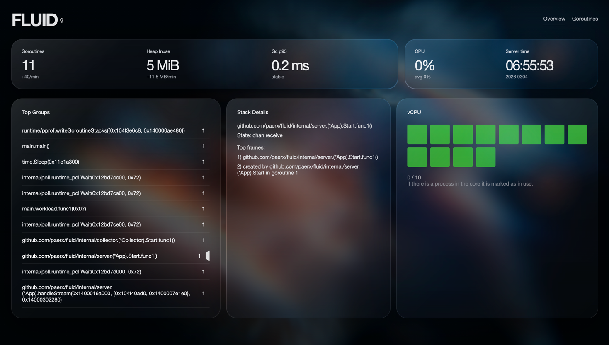
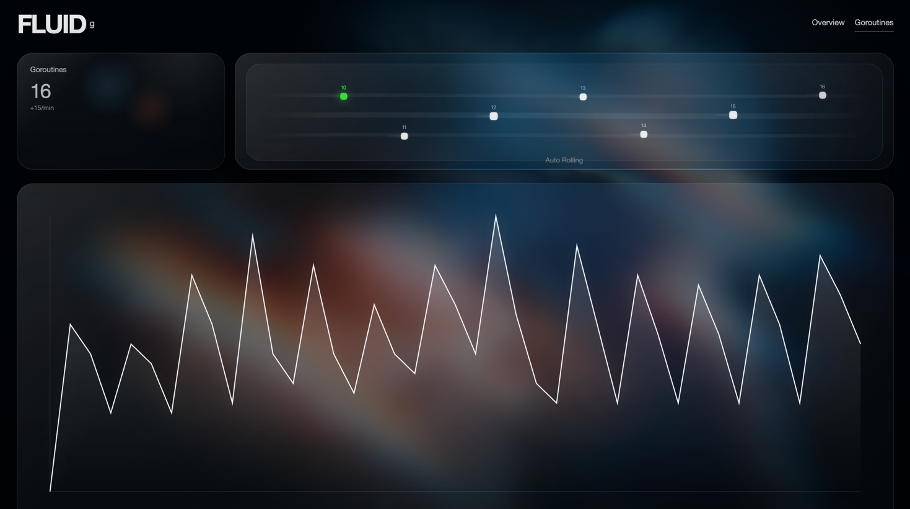

# FLUID

FLUID is an embedded Go runtime observability SDK. It runs inside your process, samples lightweight runtime metrics, captures goroutine snapshots on demand or at low frequency, and exposes a glass-style local dashboard at `/fluid`.

The goal is simple:

- one-line integration
- safe-by-default localhost exposure
- live runtime signals over HTTP + SSE
- a UI that is bundled into the SDK itself


## What It Does

FLUID focuses on three layers:

1. Lightweight runtime metrics

- goroutine count
- heap / alloc / object growth
- GC pause percentiles
- synthetic CPU grid for visual overview

2. Goroutine snapshot diagnostics

- capture goroutine dump via `runtime/pprof`
- parse stack text into goroutine blocks
- group by top function or full stack
- compute top groups and delta growth versus previous snapshot

3. Embedded dashboard

- overview cards
- goroutine flow page
- top groups + stack details
- SSE-driven live refresh

## How It Works

### 1. Embedded Mode

FLUID is linked into the target service as a normal Go dependency.

When started, it:

- launches or mounts HTTP routes
- starts a collector ticker
- stores recent samples in a ring buffer
- serves static UI assets with Go `embed`
- pushes live events over SSE

### 2. Runtime Sampling

The collector reads `runtime.MemStats` every sampling interval.

It derives:

- current goroutine count
- heap usage and object count
- alloc throughput
- GC pause quantiles
- simple signal states like `STABLE`, `GOROUTINE_RISING`, `MEMORY_PRESSURE`, `GC_BUSY`

These samples are stored in memory and exposed through:

- `GET /fluid/api/v1/metrics`
- `GET /fluid/api/v1/overview`
- `GET /fluid/api/v1/timeseries`
- `GET /fluid/api/v1/stream`

### 3. Goroutine Snapshot Parsing

For heavier diagnostics, FLUID calls:

```go
pprof.Lookup("goroutine").WriteTo(buf, 2)
```

Then it:

- splits the dump into goroutine blocks
- extracts state and stack frames
- removes framework/runtime noise when configured
- groups by first business frame by default
- returns top groups plus growth delta

### 4. Frontend Delivery

The frontend is plain embedded static assets served by the SDK itself.

That means:

- no Node runtime is needed in production
- dashboard lives at the same base path as the API
- service owners only import the SDK and call `fluid.Goroutine(...)`

## Project Structure

```text
fluid/
├── cmd/demo/                # demo service
├── internal/auth/           # token/basic auth
├── internal/collector/      # runtime metrics collection
├── internal/server/         # routes, SSE, UI serving
├── internal/snapshot/       # goroutine dump parsing
├── internal/store/          # ring buffer
├── internal/stream/         # event broker
├── internal/ui/             # embedded static UI
├── pkg/fluid/               # public SDK API
├── ui/                      # editable frontend source
├── full.md                  # design / API requirement notes
└── README.md
```

## Install

```bash
go get github.com/paerx/fluid
```

## Quick Start

### Simplest Start

```go
package main

import "github.com/paerx/fluid/pkg/fluid"

func main() {
	fluid.Goroutine()
	select {}
}
```

Open:

```text
http://127.0.0.1:6068/fluid/
```

### Recommended Start

```go
package main

import (
	"log"
	"time"

	"github.com/paerx/fluid/pkg/fluid"
)

func main() {
	handle, err := fluid.Goroutine(
		fluid.WithAddr("127.0.0.1:6068"),
		fluid.WithBasePath("/fluid"),
		fluid.WithAuthToken("YOUR_TOKEN"),
		fluid.WithSamplingInterval(1*time.Second),
		fluid.WithSnapshotInterval(12*time.Second),
	)
	if err != nil {
		log.Fatal(err)
	}
	defer handle.Close()

	select {}
}
```

### Mount on Existing Mux

```go
package main

import (
	"log"
	"net/http"

	"github.com/paerx/fluid/pkg/fluid"
)

func main() {
	mux := http.NewServeMux()

	_, err := fluid.Mount(
		mux,
		fluid.WithBasePath("/fluid"),
		fluid.WithAuthToken("YOUR_TOKEN"),
	)
	if err != nil {
		log.Fatal(err)
	}

	log.Fatal(http.ListenAndServe(":8080", mux))
}
```

## Public API

### Entry Points

```go
func Goroutine(opts ...Option) (*Handle, error)
func Mount(mux *http.ServeMux, opts ...Option) (*Handle, error)
func New(opts ...Option) *Fluid
```

### Handle

```go
type Handle struct {
	Addr     string
	BasePath string
}

func (h *Handle) Close() error
func (h *Handle) SnapshotNow() error
```

### Options

- `WithAddr(addr string)`
- `WithBasePath(path string)`
- `WithSamplingInterval(d time.Duration)`
- `WithSnapshotInterval(d time.Duration)`
- `WithSnapshotMinInterval(d time.Duration)`
- `WithMaxSnapshotSize(n int)`
- `WithAllowNetworks([]string)`
- `WithAuth(fluid.Token("..."))`
- `WithAuthToken(token string)`
- `WithMux(mux *http.ServeMux)`
- `WithUI(enabled bool)`

## Security Model

FLUID is intentionally conservative.

- default bind address is `127.0.0.1:6068`
- if you bind to non-localhost, auth is required
- token auth is supported through:
  - `Authorization: Bearer <token>`
  - `X-Fluid-Token: <token>`
- optional CIDR allowlist is supported

If you expose FLUID outside localhost, do not run it without auth.

## HTTP API

Base path defaults to `/fluid`, so the API prefix is:

```text
/fluid/api/v1
```

### Core Routes

- `GET /health`
- `GET /meta`
- `GET /metrics`
- `GET /overview`
- `GET /timeseries?metric=goroutines&window=15m&step=1s`
- `GET /cpu`
- `GET /memory`
- `POST /snapshot/goroutines`
- `GET /goroutines/top`
- `GET /goroutines/group?id=<group-id>`
- `GET /stream?topics=overview,metrics,cpu,snapshot`

### SSE Topics

- `overview`
- `metrics`
- `cpu`
- `snapshot`

## Example Requests

### Health

```bash
curl http://127.0.0.1:6068/fluid/api/v1/health
```

### Overview

```bash
curl http://127.0.0.1:6068/fluid/api/v1/overview
```

### Snapshot

```bash
curl -X POST \
  http://127.0.0.1:6068/fluid/api/v1/snapshot/goroutines \
  -H 'Content-Type: application/json' \
  -d '{"groupBy":"topFunction","topN":20,"withDelta":true}'
```

## Frontend Behavior

The current UI ships with:

- liquid-glass login transition
- Overview page
- Goroutines flow page
- top groups and stack details
- SSE-backed live updates

The editable frontend source is in `ui/`, and the embedded runtime copy is in `internal/ui/`.

## Local Development

Run the demo:

```bash
go run ./cmd/demo
```

Then open:

```text
http://127.0.0.1:6068/fluid/
```

## Open Source Positioning

This project is intended to be open-source friendly:

- no external service dependency
- local-first by default
- embeddable into existing Go services
- hackable frontend without mandatory build tooling

Recommended open-source packaging:

- repository: `github.com/paerx/fluid`
- SDK package: `github.com/paerx/fluid/pkg/fluid`
- demo app included under `cmd/demo`

## Current Scope

Implemented today:

- embedded server
- runtime metrics collector
- in-memory timeseries
- goroutine snapshot parsing
- snapshot delta comparison
- token/basic auth
- SSE push
- bundled UI

Not implemented yet:

- real per-core CPU sampling from OS metrics
- WebSocket control channel
- distributed aggregation
- flamegraph / full pprof visualization
- formal test suite


